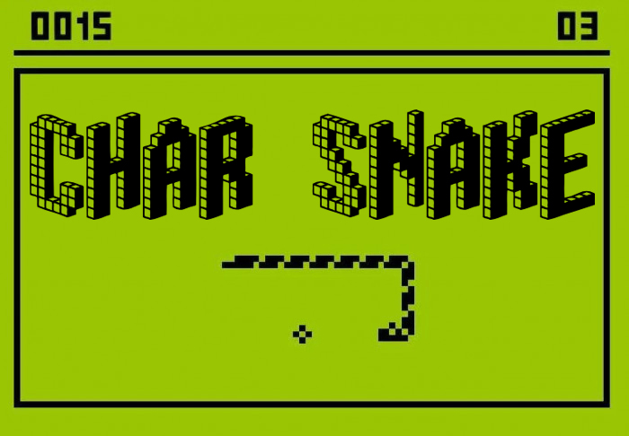
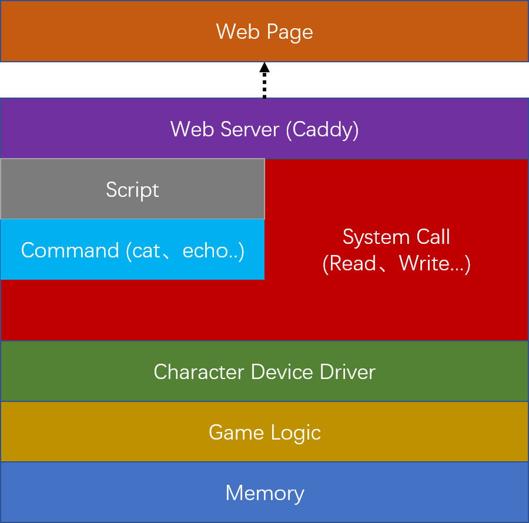

<div align="center">
    
</div><br />

# 🐍 Char Snake | Linux字符设备驱动贪吃蛇游戏 🕹️


该项目是一个经典的贪吃蛇游戏，使用 Linux 字符设备驱动来封装游戏逻辑，实现以读写文本的方式进行游玩。为了方便游玩，游戏使用网页通过字符呈现，使得该游戏不仅可以在命令行中使用进行控制，也可以在网页端在线游玩。

更加详细的介绍以及游戏的试玩，欢迎前往[我的博客](https://www.amrzs.net/2023/03/19/char_snake/)体验。

## 📖 说明
该游戏以字符设备scull为原型实现的字符驱动设备为基础，提供了统一的接口可以使用echo与cat等命令在终端进行控制；并且可以通过脚本快速且简单的进行驱动的安装卸载、游戏的移动控制、网络服务器的运行启动等功能；配合Caddy服务器实现地图数据的请求与控制命令的响应。

<div align="center">
    
    <p>贪吃蛇游戏架构</p>
</div><br />

## 🛠️ 安装

> 下面步骤均以 Debian 系统为例

安装开发用的源码和头文件包，克隆项目获取源码

```
$ sudo apt install linux-headers-$(uname -r)
$ git clone https://github.com/CCBP/CharSnake.git
```

进入项目目录，使用脚本编译并安装驱动

```
$ cd CharSnake
$ ./snake.sh build            # 编译驱动
$ sudo ./snake.sh install     # 安装驱动
```

运行静态文件服务器，响应客户端对 `src/web/` 路径下文件的访问请求（脚本使用 `assets/caddy/` 目录下带有exec模块的caddy作为服务器后端）

```
$ ./snake.sh run
```

打开浏览器并输入 http://127.0.0.1:2019 即可开始游玩

## 🎮 游戏操作

### 网页端

> 下方游戏界面仅为演示，实际游玩请前往[我的博客](https://www.amrzs.net/2023/03/19/char_snake/)体验

<html>
 <head></head>
 <body>
  <table align="center"> 
   <tbody>
    <tr> 
     <td rowspan="7" width="20%"> <pre id="map">...........<br />...........<br />...........<br />....##*....<br />....#......<br />....@......<br />...........<br />...........<br />...........<br />....$......<br />...........<br /></pre> </td> 
     <th colspan="6" width="60%">游戏玩法</th> 
    </tr> 
    <tr> 
     <td colspan="6"><code>W</code> <code>S</code> <code>A</code> <code>D</code> 向上、下、左、右移动</td> 
    </tr> 
    <tr> 
     <td colspan="3"><code>Space</code> 暂停游戏</td> 
     <td colspan="3"><code>R</code> 重新开始</td> 
    </tr> 
    <tr> 
     <th colspan="6">游戏信息</th> 
    </tr> 
    <tr> 
     <td colspan="2"><code>@</code> 蛇头</td> 
     <td colspan="2"><code>#</code> 蛇身</td> 
     <td colspan="2"><code>*</code> 蛇尾</td> 
    </tr> 
    <tr> 
     <td colspan="3"><code>$</code> 食物</td> 
     <td colspan="3"><code>.</code> 空白地图</td> 
    </tr> 
    <tr> 
     <td colspan="3"><code>O</code> 游戏成功</td> 
     <td colspan="3"><code>X</code> 游戏失败</td> 
    </tr> 
    <tr> 
     <td></td> 
     <td width="10%"></td> 
     <td width="10%"></td> 
     <td width="10%"></td> 
     <td width="10%"></td> 
     <td width="10%"></td> 
     <td width="10%"></td> 
    </tr> 
   </tbody>
  </table>
 </body>
</html>

### 命令行

```
$ cat /dev/char_snake        # 打印地图
...........
.........$.
...........
...........
...........
.....@.....
...........
...........
...........
...........
...........
 
$ echo W > /dev/char_snake   # 向上移动
$ cat /dev/char_snake        # 打印地图
...........
.........$.
...........
...........
.....@.....
...........
...........
...........
...........
...........
...........
```

## 📝 TODO

这个项目只是我个人学习练手所建，目前只是完成了它的基本功能，还有很大的优化空间

- 地图字符呈现方式优化
- 定时器刷新地图数据
- IoCtrl 接口实现游戏控制
- 可变地图尺寸与获胜条件
- 支持多人同时在线游玩
- . . .